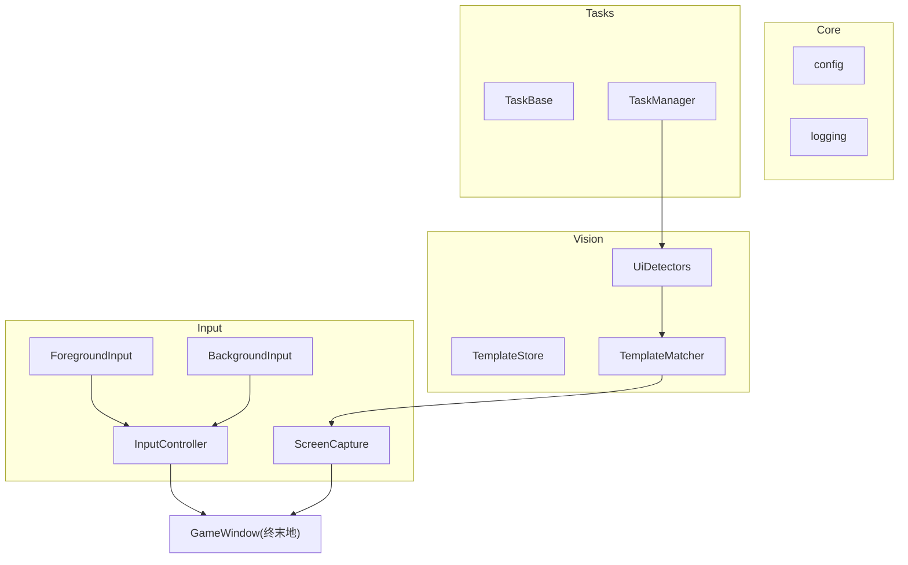

# Endfield-AI 基础架构设计方案

### 目标

- **仅支持 PC 端** 的《明日方舟：终末地》自动化（不考虑安卓模拟器）。  
- 参考 `genshin_impact_assistant-main` 的整体思路，但：命名更清晰、模块边界更干净、依赖更简洁。  
- 第一阶段优先实现：**输入/交互核心** + **基础视觉模块**，并预留前台/后台双实现接口。

---

### 一、整体分层设计

建议在 `Endfield-AI` 下，按功能划分如下目录（部分可后续再实现）：

- **`core/`**：核心通用基础设施
- `core/config.py`：配置加载 & 全局常量
- `core/logging.py`：日志封装
- `core/types.py`：基础类型别名（坐标、矩形、截图对象等）
- **`input/`**：输入与交互层（本次重点）
- `input/base.py`：抽象接口 `InputController`
- `input/foreground.py`：前台实现（pyautogui + win32）
- `input/background.py`：后台实现（预留接口，暂时简单 stub 或使用 PostMessage）
- `input/screenshot.py`：截图封装（基于 win32/DirectX，先用简单实现）
- **`vision/`**：视觉与识别（本次重点的“基础版”）
- `vision/templates.py`：模板资源管理（读取本地图片模板）
- `vision/matching.py`：模板匹配封装（基于 OpenCV）
- `vision/detectors.py`：一些高层封装：例如“检测某个按钮是否存在”“检测 UI 状态”等
- **`tasks/`**：任务与脚本调度（后续扩展）
- `tasks/base.py`：任务基类（生命周期、状态）
- `tasks/manager.py`：任务队列与线程调度
- **`cli/` 或 `ui/`**（后续扩展）：启动脚本与控制界面
- `cli/main.py`：命令行入口（选择任务/模式）

用一个简化的结构示意：

---

### 二、输入/交互核心设计（对标 `itt`，但更清晰）

#### 1. 抽象接口 `InputController`

文件：`input/base.py`

- 定义一组与具体实现无关的接口，类似但更精简于 `InteractionBGD`：
- **鼠标：**
    - `move_to(x: int, y: int, relative: bool = False) -> None`
    - `click(button: str = "left") -> None`
    - `double_click(button: str = "left") -> None`
    - `mouse_down(button: str = "left") -> None`
    - `mouse_up(button: str = "left") -> None`
    - `drag_to(x: int, y: int, button: str = "left") -> None`
- **键盘：**
    - `key_down(key: str) -> None`
    - `key_up(key: str) -> None`
    - `key_press(key: str, duration: float | None = None) -> None`
- **辅助：**
    - `sleep(seconds: float) -> None`（轻封装，统一用 logging 输出）
- 设计要点：
- 不直接暴露 pyautogui/win32，大部分模块只依赖 `InputController` 抽象。
- 键值约定：统一使用人类友好的字符串（`"w"`, `"space"`, `"esc"` 等），在实现内部做映射。

#### 2. 前台实现 `ForegroundInput`

文件：`input/foreground.py`

- 以 `pyautogui` + `pywin32` 为主，实现 `InputController` 接口：
- 鼠标移动：`pyautogui.moveTo` / `moveRel`
- 点击：`pyautogui.click` / `mouseDown` / `mouseUp`
- 键盘：`pyautogui.keyDown` / `keyUp` / `press`
- 与 GIA 相比的改进：
- 坐标系：**统一用“窗口内坐标”**（0,0 为客户区左上角），在底层转换为屏幕坐标。
- 引入 `WindowHandle` 辅助类（例如 `core/window.py`，可后续加），集中处理：
    - 获取游戏窗口句柄
    - 将窗口内坐标转换为屏幕坐标
    - 窗口激活与前置

#### 3. 后台实现接口 `BackgroundInput`

文件：`input/background.py`

- 第一阶段可以只做一个“占位实现”，接口签名和 `InputController` 相同，但内部：
- 要么抛出 `NotImplementedError`
- 要么简单调用前台实现（方便以后无痛切换为真正后台实现）。
- 保证外部调用只面向 `InputController`，将来接大漠或其他驱动时，只需改这里。

#### 4. 截图模块 `ScreenCapture`

文件：`input/screenshot.py`

- 目标：代替 GIA 里 `InteractionBGD.capture` 的复杂逻辑，先做一个清晰简单版：
- `grab(region: Rect | None = None) -> np.ndarray`  
- 内部用 `mss` 或 `win32` 实现，对外只返回 BGR/RGB 图像。
- 提供：
- 游戏窗口内截图（根据窗口句柄计算区域）
- 全屏截图（region = None）

---

### 三、基础视觉模块设计

#### 1. 模板管理 `TemplateStore`

文件：`vision/templates.py`

- 作用：集中管理所有 UI 模板图片及其元数据：
- 模板路径、匹配阈值、感兴趣区域（ROI）、用途说明。
- 对比 GIA 的 `asset`/`img_manager`：
- 我们用更轻量的方式，例如：
    - 定义 `Template` 数据类：`name`, `path`, `threshold`, `roi` 等。
    - 提供 `load_template(name) -> Template`，内部缓存已加载图像。

#### 2. 模板匹配 `TemplateMatcher`

文件：`vision/matching.py`

- 基于 OpenCV 实现最小可用的模板匹配：
- `match(screen: np.ndarray, template: Template) -> MatchResult | None`
- `exists(screen, template) -> bool`
- `MatchResult` 数据类包含：
- `score: float`
- `rect: Rect`（匹配到的位置）
- `center: Point`

#### 3. UI 检测封装 `UiDetectors`

文件：`vision/detectors.py`

- 基于 `ScreenCapture` + `TemplateMatcher` 组合出一些高层接口：
- `wait_for(template_name, timeout)`：轮询截图 + 匹配，直到某 UI 出现
- `click_if_exists(template_name)`：如果某按钮存在，则点击其中心
- 这相当于把 GIA 的 `appear_then_click` 等能力用更干净的接口重写。

---

### 四、命名与代码规范

- **命名风格：**
- 模块/包：`snake_case`（例如 `input`, `vision`, `tasks`）。
- 类：`PascalCase`（`InputController`, `ForegroundInput`, `TemplateMatcher`）。
- 函数与变量：`snake_case`，但避免缩写不明的名字（不用 `itt`，改用 `input_ctrl` 或 `input_client`）。
- **类型标注：**
- 全面使用 Python 类型注解，配合 `mypy`/`pyright` 可选检查。
- 自定义 `Point`, `Rect`, `MatchResult` 等数据类放在 `core/types.py` 或各自模块。
- **错误处理：**
- 对外暴露清晰的异常类型，如 `WindowNotFoundError`, `ScreenshotError`, `MatchTimeoutError` 等。
- **文档：**
- 关键接口（如 `InputController`, `ScreenCapture`, `TemplateMatcher`）必须写 docstring，描述用途和参数含义。

---

### 五、分阶段落地顺序

1. **初始化工程结构**（在 `Endfield-AI` 新建上述目录和空模块）：

- `core/`、`input/`、`vision/` 的基础文件结构
- 在 `requirements.txt` 中添加：`pyautogui`, `opencv-python`, `mss` 或其他截图库

2. **实现 `InputController` + `ForegroundInput` + 简单截图**：

- 完成前台键鼠操作、窗口坐标转换、基础截图功能
- 写一个简单 demo（例如 `examples/move_and_click.py`）验证：
    - 能移动到窗口中心点击
    - 能按下/松开键盘按键

3. **实现基础视觉模块**：

- 完成 `Template`, `TemplateStore`, `TemplateMatcher`
- 写一个简单 demo：检测并点击“开始游戏”按钮。

4. **预留后台实现与任务系统接口**：

- 后台实现先只 stub，接口兼容
- 设计 `TaskBase`、`TaskManager` 的类结构，但功能可以先很简单。

5. **后续迭代**：

- 根据终末地具体 UI 和玩法，扩展更多 Detector/Task。

---

### 六、后续可以直接对标迁移的 GIA 概念

当基础架构搭好后，你可以有针对性地从 GIA 中迁移/重写以下概念：

- `InteractionBGD` → 拆成 `InputController` + `ScreenCapture`（已规划）。